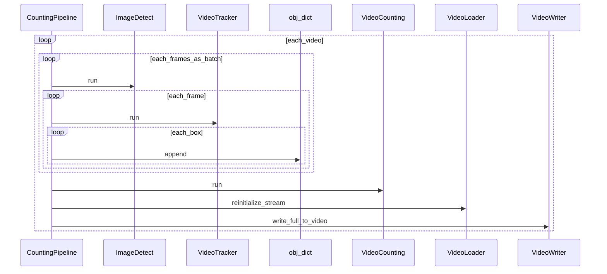

```mermaid
sequenceDiagram
    loop each_video
        loop each_frames_as_batch
            CountingPipeline->>ImageDetect: run
            loop each_frame
                CountingPipeline->>VideoTracker: run
                loop each_box
                    CountingPipeline->>obj_dict: append
                end
            end
        end

        CountingPipeline->>VideoCounting: run
        CountingPipeline->>VideoLoader: reinitialize_stream
        CountingPipeline->>VideoWriter: write_full_to_video

    end
```