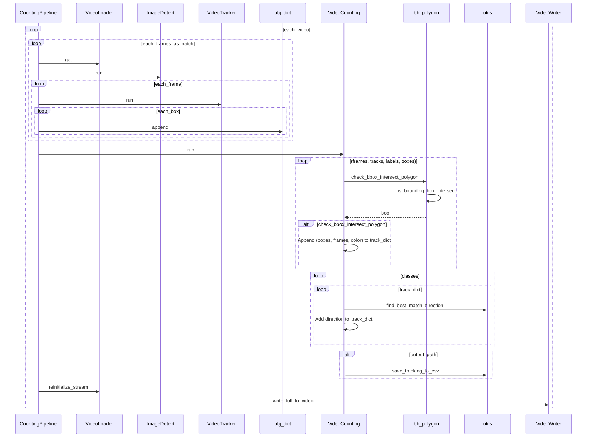

```mermaid
sequenceDiagram
    loop each_video
        loop each_frames_as_batch
            CountingPipeline->>VideoLoader: get
            CountingPipeline->>ImageDetect: run
            loop each_frame
                CountingPipeline->>VideoTracker: run
                loop each_box
                    CountingPipeline->>obj_dict: append
                end
            end
        end

        CountingPipeline->>VideoCounting: run
            loop (frames, tracks, labels, boxes)
                VideoCounting ->> bb_polygon: check_bbox_intersect_polygon
                bb_polygon ->> bb_polygon: is_bounding_box_intersect
                bb_polygon -->> VideoCounting: bool
                alt check_bbox_intersect_polygon
                    VideoCounting ->> VideoCounting: Append (boxes, frames, color) to track_dict
                end
            end
            loop classes
                loop track_dict
                    %% コサイン類似度で進行方向を判別している
                    VideoCounting ->>+ utils: find_best_match_direction
                    VideoCounting ->>+ VideoCounting: Add direction to 'track_dict'
                end
            end
            alt output_path
                VideoCounting ->>+ utils: save_tracking_to_csv
            end

        CountingPipeline->>VideoLoader: reinitialize_stream
        CountingPipeline->>VideoWriter: write_full_to_video

    end
```